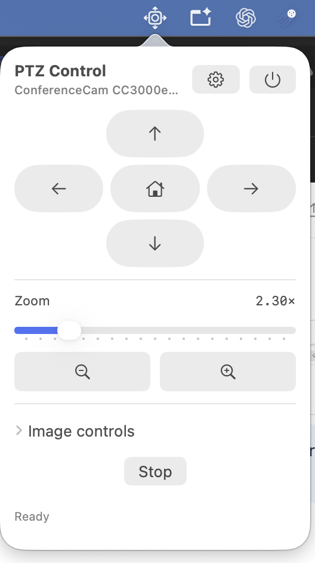
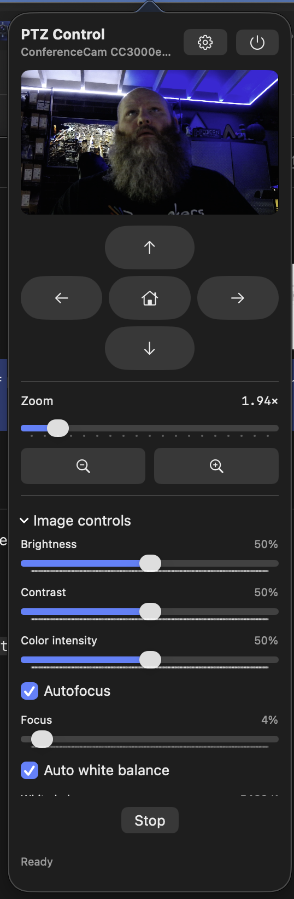
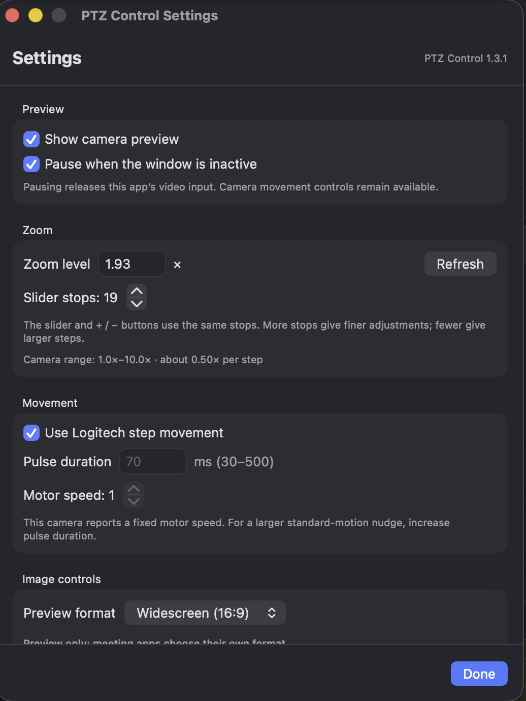

# PTZ Control for Mac

Native Apple Silicon controls for the **Logitech ConferenceCam CC3000e**, right in your macOS menu bar.

[Download on the Mac App Store](https://apps.apple.com/app/idYOUR_APP_ID) · [Build & technical guide](PTZControl_Mac/README.md)

The App Store listing is coming soon. Replace `YOUR_APP_ID` in the link above when the app is published.

## Why I built this

I love my Logitech CC3000e. It still does exactly what I need, and I primarily use macOS. I wanted to keep using a perfectly good camera without depending on an aging Intel-only control app.

The prospect of losing Logitech's app as macOS moves beyond Intel software and Rosetta was the motivation to build my own. My goal was simple: keep the camera useful long after the software it shipped with has had its day.

PTZ Control is the result—a small, native Mac app that brings the controls I use into the menu bar. Pan, tilt, zoom, check the framing, and adjust the picture. Then close the panel and get back to the call.

The camera has plenty of life left in it. This project is about giving it software that can keep up.

## Your camera, a click away

Click the camera-and-arrows icon to open the controls. The panel fits what you need: keep the live preview visible while framing a shot, or turn it off for a smaller footprint. Expand the image controls when you want to fine-tune the picture.

<table>
  <tr>
    <th>Compact controls</th>
    <th>Preview and image adjustments</th>
  </tr>
  <tr>
    <td valign="top"></td>
    <td valign="top"></td>
  </tr>
</table>

## Frame it. Focus it. Make it yours.

- **Pan, tilt and zoom** from one compact panel, with Home and Stop close at hand.
- **Choose your zoom steps.** Use the slider or plus/minus buttons, and adjust the number of stops in Settings.
- **See the shot.** An optional live preview can pause when the panel is inactive, releasing this app's video input.
- **Take control of focus.** Leave autofocus on, or switch it off and adjust focus manually.
- **Tune the image.** Adjust brightness, contrast, color intensity, white balance and 50/60 Hz anti-flicker. Restore image defaults without changing your framing.
- **Feel at home on Mac.** Light and dark appearance, a menu bar icon, and a separate settings window when you need more room.

Standard and widescreen options apply to this app's preview. Your meeting app chooses its own video format.

  

## Built for the next chapter

PTZ Control is written in Swift and builds natively for **Apple Silicon**, with **macOS 14 or later** as its deployment target. It communicates with the camera through macOS USB APIs and uses Apple's video framework for the optional preview. It needs neither Rosetta nor Logitech's legacy control application.

The CC3000e is the camera this project was built around and tested with. Support for other cameras isn't assumed.

## Get started

1. Download the app from the Mac App Store, or build the project in Xcode.
2. Launch PTZ Control. Connect your CC3000e for hardware controls, or choose **Try Demo mode** to explore without a camera.
3. Click the camera icon in the menu bar. Allow Camera access if you want the live preview.
4. Use the gear button to open Settings and make it your own.

See the [project README](PTZControl_Mac/README.md) for build instructions, permissions, diagnostics and current validation details.

## Try it without hardware

When no suitable camera is connected, the panel explains the CC3000e requirement and offers **Try Demo mode** and **Rescan**. Demo mode has a persistent label in the panel and Settings. Pan, tilt, zoom, Home and image adjustments operate on an illustrated simulated preview; no camera permission or hardware is needed. Focus and color effects are illustrative; anti-flicker is a sample setting.

Choose **Exit demo & scan for camera** after connecting a CC3000e. Demo values are discarded and are never applied to hardware.

## Privacy policy

PTZ Control does not collect, store, sell, or share personal data. Camera access is used only to show the optional live preview on your Mac; the app does not upload camera video, images, audio, or camera-control data.

The developer may receive aggregate, non-identifying app analytics that Apple provides through its App Store mechanisms. Any data Apple collects or processes is governed by [Apple's Privacy Policy](https://www.apple.com/legal/privacy/). PTZ Control does not use third-party analytics, advertising, tracking, or data-sharing services.

For privacy questions, contact the developer through this repository's issue tracker.

## Built on shared knowledge

Thanks to [cameractrls](https://github.com/soyersoyer/cameractrls) and [xMRi/PTZControl](https://github.com/xMRi/PTZControl) for the open-source work that helped make sense of the camera's controls. This project implements a native macOS backend.

An independent community project, unaffiliated with Logitech. See the [license](PTZControl_Mac/LICENSE).
